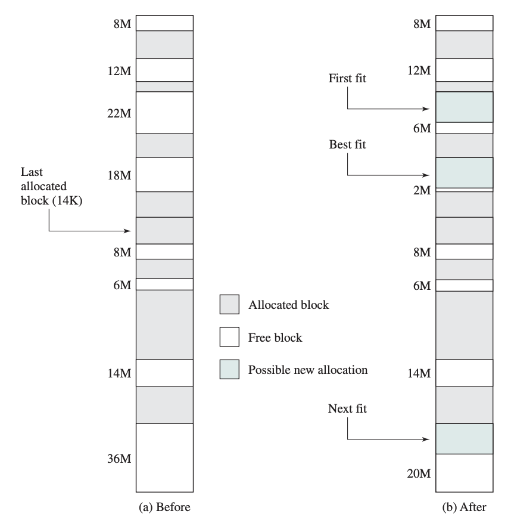

# Lab 03: Memory Management
In this lab, you will explore how operating systems manage virtual and physical memory. You’ll do this by building a simple memory management simulator in C that mimics how `malloc` (allocation) and `free` (deallocation) work.  

Your simulator (referred to as the `simulator`) will focus on the following concepts:

- frame allocation  
- frame placement algorithms  
- page mapping  

The goals of this lab are:

1. Understand how physical frames (`frames`) are allocated and managed in main memory.  
2. Learn how virtual pages (`pages`) are assigned and mapped to physical frames.  
3. Experiment with three different frame placement-algorithms that determine where pages are placed in main memory.  
4. Compare placement algorithms performance by looking at factors like fragmentation, number of probes, and allocation failures.  

## Table of Contents

*   [References](#references)
*   [Policies](#policies)
*   [Frame](#frame)
	* [Management](#frame-management)
    * [Allocation](#frame-allocation)
    * [Deallocation](#frame-deallocation)
*   [Page](#page)
	* [Management](#page-management)
    * [Mapping](#page-mapping)
    * [Unmapping](#page-unmapping) 
*   [Simulation](#simulation)
    * [Management](#simulation-management)
    * [Heap allocation](#heap-allocation)
    * [Heap deallocation](#heap-deallocation)
    * [Execute](#execute-simulation)
    * [Examples](#example-simulations)
*   [Test Harness](#test-harness)
*   [Assignment](#assignment)
*   [Honors Section](#honors-section)
*   [Submission](#submission)

## References
Before starting the lab, review the references below. These materials cover virtual memory (pages and frames), and basics about frame placement algorithms.

* Virtual memory:
  * [OSTEP: Chapter 18](https://pages.cs.wisc.edu/~remzi/OSTEP/vm-paging.pdf).
  * [Course materials](https://uncch.instructure.com/courses/109159/pages/schedule).
* Placement Algorithms:
	* [OSTEP: Chapter 17](https://pages.cs.wisc.edu/~remzi/OSTEP/)
	* [Supplemental Material](supplemental_material/Placement_Algorithm.pdf). 


## Policies

### Collaboration

This is a team project, and the assignments are available on this Canvas assignment webpage. Please be welcoming and kind to the students in your team (i.e., be a good classmate).

**You may not change groups or work alone.** Any deviations will result in a zero grade. If you have questions about what is allowed or not, you must ask. Saying later that you didn't understand or were unsure is not an acceptable excuse.

**Collaboration is permitted only within your assigned team.** There may be **no collaboration, discussion, or sharing of work between different teams**. All submitted work must be **entirely the product of your own team**.

To ensure fairness for everyone, the **collaboration policy will be strictly enforced**. Any violation may result in **a zero for all students involved**.

### AI 

AI may not be used to generate a coding solution. Your solution must be your own work. If you have any questions about what is or isn't allowed, you must ask. Saying afterwards that you didn't understand or were unsure is not an acceptable excuse.

To ensure fairness for everyone, the **AI policy will be strictly enforced**. Any violation may result in **a zero for all students involved**.

## Frame

### Frame management

In this simulation, physical memory is **abstracted** using a data structure called a **memory map** (`memmap`). This structure keeps track of all frames in main memory, where each frame is either **occupied** (holding a page) or **empty** (not currently in use). 

This is implemented using the `memmap_t` struct shown below:

```c
typedef struct {
  page_t** frames;
  unsigned int length; 
  unsigned int last_placement_frame;                     
} memmap_t;
```
The structure contains three fields:

- **frames**: A fixed-size array where each element is a pointer to a page.  
- **length**: The total number of elements in the `frames` array (i.e., the total amount of main memory).  
- **last_placement_frame**: The index of the most recently allocated frame (used by the next-fit placement algorithm).  

Each index in the `frames` array corresponds to a physical frame number (pfn) or physical address in main memory:

- If a frame is **empty**, the corresponding array element is `NULL`.  
- If a frame is **occupied**, the element points to the page stored in that frame.  

<mark>**Note:** To simplify the simulation, each frame corresponds to a single main memory address (or byte). As a result, each page also corresponds to a single virtual address (i.e., page and frame sizes are the same). Therefore, there is **no need** to consider frame or page offsets.</mark>  

### Frame allocation

The allocation of a **contiguous group of frames** (referred to as a `block`) in main memory is determined using one of the three frame placement algorithms described below:

- **Best-fit**: Chooses the block that is closest in size to the requested allocation. Starting from the first frame and probing through to the last, this algorithm examines all possible blocks and selects the smallest block that is large enough to satisfy the request.  

- **First-fit**: Chooses the first block that is large enough for the requested size. Starting from the first frame, this algorithm probes forward and stops as soon as it finds a suitable block.  

- **Next-fit**: Similar to first-fit, but instead of starting at the beginning of memory, it begins probing from the location of the last successful placement. It then probes forward to find the next block that is large enough.  

The figure below illustrates how the three algorithms place a segment of size 16 MB, where a block is a contiguous group of frames in physical memory.  



For each placement algorithm:

- If a suitable block is found, the algorithm returns the address of the first frame in that block.  
- If no suitable block is found, the algorithm returns a `frame error`, indicating that there is not enough physical memory to satisfy the request.  

**Additional notes**:

- For **best-fit**, there is one exception: if a *perfect fit* is found (i.e., a block exactly matches the requested size), the algorithm stops early since no better option exists.  

- For **next-fit**, if the search reaches the end of memory, it wraps around to the beginning and continues scanning. The search stops once it returns to the original starting point (i.e., the last placement location).  

In the `sim.c` file, frame allocation is performed by calling the `allocate` function shown below:

```c
int allocate(unsigned int size) { ... }
````
This function attempts to allocate a contiguous block of frames in main memory.

- **size**: The number of frames requested (i.e., the size of the block to allocate).  

The function returns:

- The **starting frame** (pfn) of the allocated block if the allocation is successful.  
- A **frame error** (see `sim.h`) if there is not enough contiguous free memory to satisfy the request.  

Internally, this function uses one of the frame placement algorithms (e.g., best-fit, first-fit, or next-fit) to locate a suitable block of frames.

### Frame deallocation

In the `sim.c` file, frames are deallocated by calling the `unallocate` function shown below:

```c
void unallocate(unsigned int pfn, unsigned int size) { ... }
```

This function frees a contiguous block of frames in main memory.

- **pfn**: The starting frame (main memory address) of the block to be deallocated.  
- **size**: The number of frames to free.  

The function iterates over each frame in the specified block and sets the corresponding entries in the `frames` array to `NULL`, indicating that the frames are empty.  

After this operation, the frames in the block are available for future allocations.  


## Page

### Page management

In this simulation, virtual memory is **abstracted** using two data structures: a **page** and a **page table**.

A **page** is implemented using the `page_t` struct shown below:

```c
typedef struct {
  unsigned short pfn;    
  unsigned char present; 
} page_t;
```

This structure contains two fields:

- **pfn**: The frame number that the page is mapped to.  

- **present**: Indicates whether the page is currently stored in a frame  
  - `0` = not present  
  - `1` = present (cached in memory)  

The **page table** is implemented using the `mm_struct_t` struct shown below:

```c
typedef struct {            
  page_t** page_table; 
  unsigned int length;               
} mm_struct_t;
```

This structure contains two fields:

- **page_table**: A fixed-size array where each element is a pointer to a page.  

- **length**: The total number of virtual addresses (i.e., the number of entries in the `page_table` array).  

Each index in the `page_table` array corresponds to a virtual address:

- If a virtual address is **not in use**, the page’s `present` field is set to `0`.  

- If a virtual address is **in use**, the page's `present` field is set to `1`, and the `pfn` stores the physical frame number (or physical address) where the page resides.   

<mark>**Note:** To simplify the simulation, each frame corresponds to a single main memory address (or byte). As a result, each page also corresponds to a single virtual address (i.e., page and frame sizes are the same). Therefore, there is **no need** to consider frame or page offsets.</mark>  

### Page mapping

The mapping of a **contiguous group of pages** (referred to as a `block`) in virtual memory is determined using the **first-fit placement algorithm**. Specifically, the first block that is large enough to satisfy the requested size is chosen. Starting from the first page in the page table, this algorithm scans forward and stops as soon as it finds a suitable block.  

In the `sim.c` file, page mapping is performed by calling the `map` function shown below:

```c
int map(unsigned int size) { ... }
````
This function attempts to map a contiguous block of pages in the page table.

- **size**: The number of pages requested (i.e., the size of the block to map).  

The function returns:

- The **starting page index** (virtual page number, or `vpn`) of the mapped block if the mapping is successful.  

- A **page error** (see `sim.h`) if there is not enough contiguous virtual memory to satisfy the request.  


### Page unmapping

In the `sim.c` file, pages are unmapped by calling the `unmap` function shown below:

```c
void unmap(unsigned int vpn, unsigned int size) { ... }
```

This function unmaps a contiguous block of pages in the page table.

- **vpn**: The starting page index (virtual address) of the block to be unmapped.  

- **size**: The number of pages to unmap.  

The function iterates over each page in the specified block and sets the corresponding `present` field to `0` in the `page_table` array, indicating that the pages are no longer mapped.  

After this operation, the pages in the block are available for future mappings.   


## Simulation management and operations

### Simulation management

The overall state of the memory management simulator is maintained using the `sim_t` struct shown below:

```c
typedef struct {
  pointer_t** ptable;
  unsigned int table_size;
  unsigned int seed;
  unsigned int time_units;
  unsigned int placement_algorithm;
  unsigned int num_probes;
  unsigned int page_error;
  unsigned int frame_error;
} sim_t;
```

This structure is used to store the information needed to run and evaluate the simulation.

It contains the following fields:

- **ptable**: A fixed-size array of pointers that stores active allocations returned by `s_malloc`. Each entry represents a block currently being tracked by the simulator.  

- **table_size**: The total number of entries in the `ptable` array.  

- **seed**: The seed value used for any random behavior in the simulation. This helps make results reproducible.  

- **time_units**: Tracks the progression of simulated time. This value can be used to determine how long allocations remain active in memory.  

- **placement_algorithm**: Indicates which frame placement algorithm the simulator is currently using (e.g., best-fit, first-fit, or next-fit).  

- **num_probes**: Counts how many probes are performed while searching for available blocks in memory. This is one of the metrics used to evaluate placement algorithm performance.  

- **page_error**: Counts the number of page mapping failures that occur during the simulation.  

- **frame_error**: Counts the number of frame allocation failures that occur during the simulation.  

In general, this structure acts as the central control structure for the simulator. It keeps track of active allocations, simulation settings, and performance statistics, making it possible to manage memory operations and evaluate how well different placement algorithms perform.

### Heap allocation

In the `sim.c` file, heap memory is allocated using the `s_malloc` function shown below:

```c
pointer_t* s_malloc(unsigned int size, unsigned int duration) { ... }
```

This function allocates a contiguous block of pages that represents an array of bytes in virtual memory.

- **size**: The size of the array (in bytes).  

- **duration**: The number of time units the allocated memory will remain in main memory.  

The function returns a **pointer** implemented using the `pointer_t` struct shown below:

```c
typedef struct {
  unsigned int vpn;
  unsigned int size;
  unsigned short duration; 
} pointer_t;
```
This structure contains three fields:

- **vpn**: The starting virtual page number returned by the page mapping function.  

- **size**: The total number of allocated bytes.  

- **duration**: The number of time units the allocation will remain active (as specified in `s_malloc`).  .

The general steps for the `s_malloc` function are outlined in the pseudocode below:

```
1. Set `ptr` to `NULL`  
2. Allocate `size` frames in physical memory  
3. Map `size` pages in virtual memory  
4. If frame allocation fails, record a frame error  
5. If page mapping fails, record a page error  
6. If both allocations succeed:  
   a. For each page in the block:  
      i. Mark the page as present  
      ii. Record the frame number for that page  
      iii. Update the memory map so the frame points to the page  
   b. Create a pointer structure  
   c. Store the starting virtual page number, size, and duration in the pointer  
7. Return `ptr`  
```

### Heap deallocation

In the `sim.c` file, heap memory is deallocated using the `s_free` function shown below:

```c
void s_free(pointer_t* ptr) { ... }
```

This function frees a contiguous block of pages and their corresponding frames in memory.

- **ptr**: A pointer to the allocated block returned by `s_malloc`.  

The general steps for the `s_free` function are outlined in the pseudocode below:

```
1. Access the starting page of the allocation using the virtual page number stored in `ptr`  
2. Retrieve the starting physical frame number from that page  
3. Deallocate the contiguous block of frames associated with the allocation  
4. Unmap the contiguous block of pages associated with the allocation  
5. Free the pointer structure  
6. Set the pointer to `NULL`  
7. Return  
``` 

After this operation, both the pages and frames associated with the allocation are available for future use.  

### Execute simulation

The program in `lab02.c` runs the simulation.

Using the provided `Makefile`, you can compile and run the simulator as follows:

```bash
make
```
To run the simulation:
```bash
make run
```

Alternatively, you can execute the simulation directly using:
```bash
./lab03 1 512 512 200 1234
```
where:

- The first parameter specifies the placement algorithm  
  (`1 = first-fit`, `2 = best-fit`, `3 = next-fit`).  
- The second parameter specifies the size of main memory  
  (i.e., the total number of physical addresses).  
- The third parameter specifies the size of virtual memory  
  (i.e., the total number of virtual addresses).  
- The fourth parameter specifies the simulation duration  
  (in time units).  
- The fifth parameter specifies the random number seed.  

### Example simulations

After executing the following simulation:

```bash
./lab03 1 512 512 200 1234
```

At the final time unit, the contents of the pointer table are:

```
---------------------------
    POINTER TABLE
---------------------------
VPN		SIZE	Duration
---------------------------
321		16		30
185		71		23
113		19		37
23		5		51
12		11		11
380		35		37
61		24		15
342		23		31
256		10		37
146		14		26
266		55		5
160		24		17
87		6		7
420		37		24
93		20		12
28		18		7
469		38		6
46		15		48
0		9		20

```

The summary statistics for this simulation are shown below:
```
Algorithm = First-fit
Average probes = 374.11
Frame error rate = 0.54
Page error rate = 0.54
Fragment count = 3
```

After executing the following simulation:

```bash
./lab03 2 512 512 200 1234
```

At the final time unit, the contents of the pointer table are:

```
---------------------------
    POINTER TABLE
---------------------------
VPN		SIZE	Duration
---------------------------
395		16		30
23		5		51
463		35		37
61		24		15
113		19		37
146		14		26
340		55		5
12		11		11
46		15		48
185		49		19
244		38		6
317		23		31
160		24		17
93		20		12
282		32		2
234		10		37
431		32		23
87		6		7
28		18		7
0		9		20

```

The summary statistics for this simulation are shown below:
```
Algorithm = Best-fit
Average probes = 503.86
Frame error rate = 0.47
Page error rate = 0.49
Fragment count = 3
```
After executing the following simulation:

```bash
./lab03 3 512 512 200 1234
```

At the final time unit, the contents of the pointer table are:

```
---------------------------
    POINTER TABLE
---------------------------
VPN		SIZE	Duration
---------------------------
470		16		30
23		5		51
304		23		31
61		24		15
113		19		37
388		32		2
184		55		5
245		49		19
46		15		48
146		14		26
12		11		11
93		20		12
335		53		22
294		10		37
160		24		17
28		18		7
87		6		7
420		50		12
0		9		20

```

The summary statistics for this simulation are shown below:
```
Algorithm = Next-fit
Average probes = 326.38
Frame error rate = 0.51
Page error rate = 0.49
Fragment count = 1
```

## Test Harness

The following files are used to verify the correct operation of your coding solution.

```text
.
|-- testcase.c  	 # Where your teams test cases are defined.
|-- testharness.sh   # A shell script that automates the testing process.
```


### testcase.c

All your test cases are defined as functions in the `testcase.c` file and are used to verify the correct operation of your coding solution when the simulator is **not** running. This is where you and your teammates will add your test cases, and you should spend time familiarizing yourselves with the code.

**Note:** Remember to update the `fn_table[]` whenever a new test function is added. Simply include the function name as a string and its function pointer (i.e., the function name itself). An example is provided in the starter file.

### testharness.sh

This is a Bash script used to automate the testing process by running your test cases sequentially. You and your teammates should take time to familiarize yourselves with the test harness script.

The test harness can be run directly from the command line:

````
./testharness.sh
````

Alternatively, it can be executed using `make`:

````
make test
````

**Important:** As new [test cases](#testcases.c) are added, the test harness variable `N`, which represents the total number of test cases—must be updated accordingly.


## Assignment

Only the following files can be modified by your team.

```text
.
|-- sim.c          	 # Refer to the frame, page, and simulation sections.
|-- testcase.c  	 # Where your teams test cases are defined.
|-- testharness.sh   # A shell script that automates the testing process.
```

The [test harness](#test-harness) section covers the `testcase.c` and `testharness.sh` files.

The `sim.c` file is divided into two parts: functions that **cannot** be modified and functions that **you will** modify. In `sim.c`, you **may not**:

- remove or add functions (including helper functions),
- remove or add global variables, or
- remove or add additional header files.

Failure to follow **any** of the above rules will result in **a zero grade** for you and your teammates on this lab assignment—no exceptions. If you have any questions about what is or is not allowed, you **must** ask. Claiming afterward that you did not understand or were unsure is not an acceptable excuse.

Lastly, all of these files include comments intended to guide you and your teammates. Please read them carefully.

## Honors Section

In the base simulator, a memory allocation fails when there are not enough contiguous free frames available in physical memory. In this honors extension, you will **extend** the simulator to support **memory swapping**, allowing pages to be moved to a simulated disk when main memory is full. This enhancement models how real operating systems manage memory when physical memory is limited.

When a new allocation requires frames but no free frames are available, the simulator should:

1. Select a **victim page** currently in memory  
2. **Swap out** the victim page to a simulated disk (swap space)  
3. Free the frame previously occupied by that page  
4. Use the freed frame for the new allocation  

This process allows allocations to succeed even when memory is full (i.e., frame errors should be eliminated). This extension builds on your existing simulator by introducing **page replacement and swap space**, allowing the system to continue allocating memory even when physical memory is full. This provides a more realistic model of how modern operating systems manage memory under pressure.

### Deliverables and Requirement

**Implementation** (40%)

- Modify the simulator (`sim.c` and `sim.h`) to support memory swapping.  
- Use the provided data structures as the foundation of your design.  
- You may extend existing structures and/or introduce new ones as needed.  
- You may implement additional helper functions to support your design.  
- Your implementation must compile and run without errors.  

**Documentation** (30%)

- Include a `HONOR_README.md` file in your repository.  
- Clearly and concisely describe:
  - Your design decisions  
  - Any additional data structures introduced  
  - How swapping is implemented  
  - How pages are selected for replacement  

**Correctness and Verification** (20%)

- Your implementation should correctly:
  - Swap pages out when memory is full  
  - Reuse freed frames for new allocations  
- The simulator should run without crashes or undefined behavior  
- Results should be consistent and verifiable  

**Presentation and Demo** (10%)

- You will present your design to the instructor and/or TA.  
- Be prepared to:
  - Explain your implementation  
  - Walk through key parts of your code  
  - Demonstrate your simulator running  


You are given a **significant amount of agency** in how you implement this modification. However, you are expected to remain mindful of the AI usage policies. If you have any questions or uncertainties, you **must** ask for clarification. Claiming afterward that you did not understand the requirements is not an acceptable excuse.


## Submission

### Honor code acknowledgement 

Submission of your team’s work signifies that **all team members** acknowledge and understand the [Collaboration](#collaboration) and [AI](#ai) policies.


